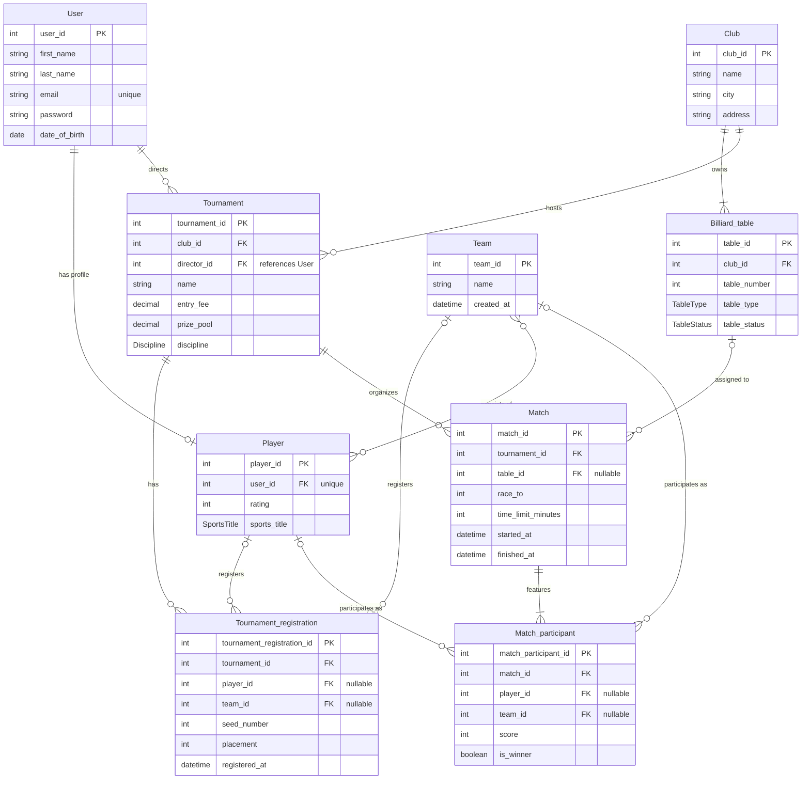

# Відповідь моделі: Концептуальна ER-модель CRM системи більярдного клубу

## Mermaid ER Діаграма

## Опис сутностей та зв'язків

1. **User (Користувач)**:
   - Базова сутність для автентифікації та профілю.
   - Зв'язок 1:0..1 з `Player` (користувач може мати профіль гравця).
   - Зв'язок 1:0..N з `Tournament` як директор/організатор (`director_id` посилається на `User`).

2. **Player (Гравець)**:
   - Спортивний профіль із рейтингом та спортивним званням (`SportsTitle`).
   - Унікальний зв'язок 1:1 з `User` (`user_id` FK unique).

3. **Club (Клуб)**:
   - Локація та організаційна база з адресою та назвою.
   - Зв'язок 1:1..N зі столами (`Billiard_table`).
   - Зв'язок 1:0..N із турнірами (`Tournament`).

4. **Billiard_table (Більярдний стіл)**:
   - Стіл з номером, типом дисципліни (`TableType`) та оперативним статусом (`TableStatus`).
   - Прив'язаний до клубу. Зв'язок 0..1:0..N із матчами (`Match`), оскільки стіл призначається на матч або під час проведення турніру.

5. **Tournament (Турнір)**:
   - Змагання з дисципліною (`Discipline`), внеском, призовим фондом, клубом проведення та призначеним директором.
   - Має множину реєстрацій (`Tournament_registration`) та матчів (`Match`).

6. **Tournament_registration (Реєстрація на турнір)**:
   - Асоціативна сутність для реєстрації учасників.
   - Підтримує як індивідуальні турніри (`player_id`), так і командні (`team_id`) через nullable FK.
   - Фіксує посів (`seed_number`) та фінальне місце (`placement`).

7. **Team (Команда)**:
   - Команда для командних змагань.
   - Зв'язок M:N з гравцями (`Player`).
   - Може реєструватися на турніри (`Tournament_registration`) та брати участь у матчах (`Match_participant`).

8. **Match (Матч)**:
   - Зустріч у межах турніру з параметрами регламенту (`race_to`, `time_limit_minutes`, часові мітки).
   - Призначається на вільний стіл (`table_id` nullable).

9. **Match_participant (Учасник матчу)**:
   - Учасник зустрічі (гравець або команда).
   - Зв'язок 1:2..N з матчем (у більярді зазвичай 2 суперники).
   - Зберігає набрані очки (`score`) та ознаку перемоги (`is_winner`) для фіксації суддею.
