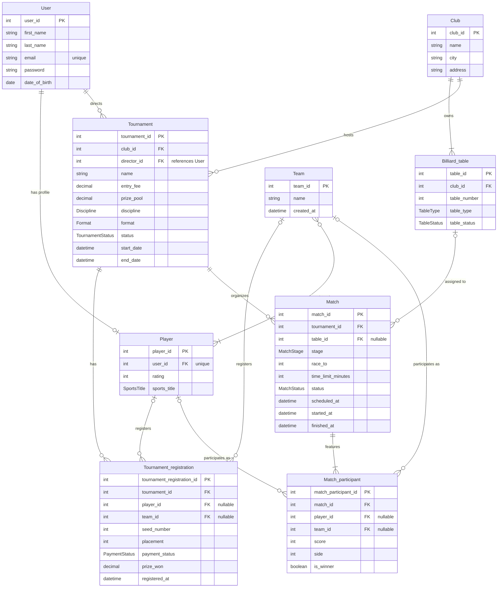

# Відповідь моделі: Регенерована концептуальна ER-модель CRM системи більярдного клубу (Ітерація 2)

## Огляд змін другої ітерації
У цій ітерації модель повністю синхронізована з оновленими вимогами `spec.md` та усунено всі зауваження з `ai/02-feedback-audit.md`:
1. **Зв'язок Team – Player (M:1..N)**: зв'язок оновлено до `Team }o--|{ Player : "consists of"`. Це гарантує правило домену: кожна команда повинна містити щонайменше одного гравця, гравець може входити до довільної кількості команд або грати сольно, зв'язок прямий M:N без асоціативної сутності відповідно до 3NF.
2. **PK сутності Billiard_table**: підтверджено відповідність `table_id PK` загальній системній конвенції `<entity>_id`.
3. **Повна синхронізація атрибутів**:
   - `Tournament`: додано `Format format`, `TournamentStatus status`, `datetime start_date`, `datetime end_date`.
   - `Tournament_registration`: додано `PaymentStatus payment_status`, `decimal prize_won`.
   - `Match`: додано `MatchStage stage`, `MatchStatus status`, `datetime scheduled_at`.
   - `Match_participant`: додано `int side`.

---

## Mermaid ER Діаграма

## Відповідність критеріям прийняття (Acceptance Criteria)
1. **Валідність синтаксису**: Код Mermaid ER відповідає офіційній специфікації Mermaid.
2. **Артефакт - діаграма**: Файл `model.mmd` містить актуальну модель.
3. **Семантичні коміти**: Зміни документуються за правилами `AGENTS.md` (`ai:`, `model:`).
4. **Аудиторський слід**: Зафіксовано промпт `ai/02-prompt-conceptual-er.md` та результат `ai/02-response-conceptual-er.md`.
5. **3NF**: Усі неключові атрибути функціонально залежать виключно від повного первинного ключа.
6. **M:N без зайвих сутностей**: Прямий зв'язок між `Team` та `Player` без введення порожньої таблиці з'єднання.
7. **Уніфікація PK/FK**: Усі ідентифікатори узгоджені (`table_id`, `user_id`, `tournament_id` тощо).
8. **Повна тотожність імен**: Імена сутностей, атрибутів та кардинальності повністю синхронізовані зі `spec.md`.
